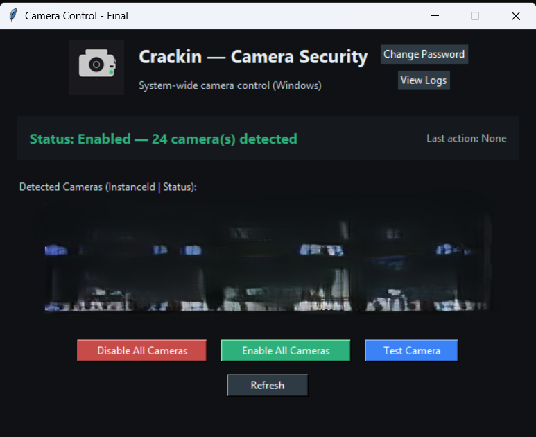
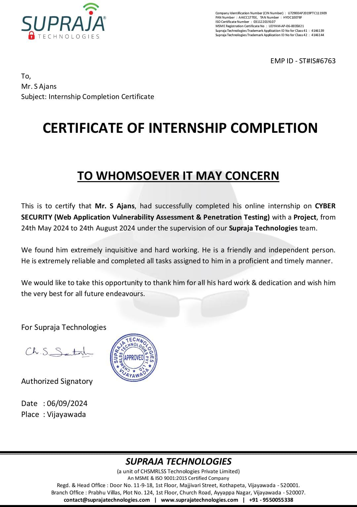

# Camera Control & Webcam Security Tool

## 📌 Project Overview
This project is a **Windows-based camera security tool** developed during my internship at **Supraja Technologies**.  
It allows users to **enable/disable all connected cameras system-wide**, add **password protection**, and log all activities.  
It also features **real-time camera preview** using OpenCV.

**Internship Duration:** May 24, 2024 – August 24, 2024  
**Internship Role:** Cybersecurity Intern – Web Application Vulnerability Assessment & Penetration Testing  
**Organization:** Supraja Technologies  

---

## 🎯 Features
- **System-wide Camera Control**
  - Enable or disable all detected cameras using PowerShell.
- **Password Protection**
  - Prevent unauthorized changes.
- **Activity Logging**
  - Every action is recorded with timestamp and username.
- **Camera Preview**
  - Test camera functionality in real-time using OpenCV.
- **Device Detection**
  - Robust detection of multiple camera types (Camera, Image, Media devices).

---

## 🛠️ Tech Stack
- **Language:** Python 3  
- **GUI:** Tkinter  
- **Image Processing:** OpenCV (optional feature)  
- **System Control:** PowerShell PnP Device cmdlets  
- **Logging:** Text-based activity logs  

---

## 📂 Project Structure
📦 Camera-Control-and-Webcam-Security-Tool
┣ 📜 webcam1.py # Main Python script
┣ 📜 password.txt # Default password storage
┣ 📜 logs.txt # Activity logs
┣ 📜 README.md # Project documentation
┗ 📜 logo.png # Application logo (if available)

---

## 🚀 How to Run
1. **Install Dependencies**
```bash
pip install pillow opencv-python

2.Run the Script
<<<<<<< HEAD
python webcam_security_tool.py
=======
<<<<<<< HEAD
python webcam1.py
>>>>>>> c212b9f (Resolve README.md merge conflict and add assets)

3.Administrator Mode Required
Tool requires admin rights to enable/disable devices.

```

Screenshots:



Internship Certificate:



📈 Skills Demonstrated
⦁	Python scripting for hardware control

⦁	GUI development with Tkinter

⦁	Secure authentication & logging

⦁	PowerShell automation

Camera device management

⚠️ Limitations

⦁	Password stored in plain text (password.txt) – should be replaced with a secure hashing mechanism.

⦁	Requires PowerShell execution – works only on Windows with administrator privileges.

⦁	No remote monitoring or alerts for unauthorized attempts.

🔮 Future Improvements
⦁	Implement secure password hashing (bcrypt/argon2).

⦁	Send logs to email with SMTP + encryption for real-time alerts.

⦁	Option for cloud backup of logs to a secure server.

⦁	Multi-user role-based access control (admin vs guest access).

⦁	Add cross-platform support for Linux and macOS.

⦁	Real-time threat detection for unknown processes accessing the camera.

📬 Contact
Name: Ajans S
Email: ajans2222s.a@gmail.com
<<<<<<< HEAD
LinkedIn: https://www.linkedin.com/in/ajans-s/
GitHub: https://github.com/Ajans-45/
=======
LinkedIn: [Your LinkedIn Link]
GitHub: [Your GitHub Link]
=======
python webcam_security_tool.py

3.Administrator Mode Required
Tool requires admin rights to enable/disable devices.

```

Screenshots:


Internship Certificate:


📈 Skills Demonstrated
⦁	Python scripting for hardware control

⦁	GUI development with Tkinter

⦁	Secure authentication & logging

⦁	PowerShell automation

Camera device management

⚠️ Limitations

⦁	Password stored in plain text (password.txt) – should be replaced with a secure hashing mechanism.

⦁	Requires PowerShell execution – works only on Windows with administrator privileges.

⦁	No remote monitoring or alerts for unauthorized attempts.

🔮 Future Improvements
⦁	Implement secure password hashing (bcrypt/argon2).

⦁	Send logs to email with SMTP + encryption for real-time alerts.

⦁	Option for cloud backup of logs to a secure server.

⦁	Multi-user role-based access control (admin vs guest access).

⦁	Add cross-platform support for Linux and macOS.

⦁	Real-time threat detection for unknown processes accessing the camera.

📬 Contact
Name: Ajans S
Email: ajans2222s.a@gmail.com
LinkedIn: https://www.linkedin.com/in/ajans-s/
GitHub: https://github.com/Ajans-45/
>>>>>>> a63cce9 (Initial commit - Webcam  Security Tool)
>>>>>>> c212b9f (Resolve README.md merge conflict and add assets)
